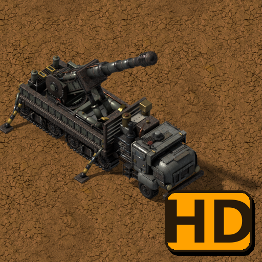
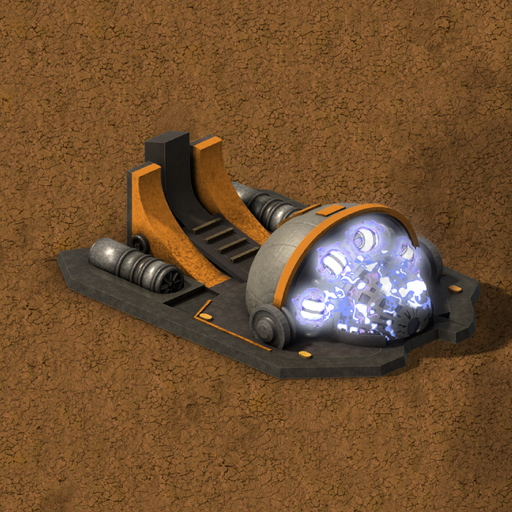

# Wolfenstain's Factorio mods — assets

Public pages and media (GIFs and images) of my Factorio 2.0 mods: the same descriptions as on the
[Factorio Mod Portal](https://mods.factorio.com/user/Wolfenstain), with their galleries.

| | Mod | |
|---|---|---|
|  | **[Heavy Trucks (Vanilla+)](heavy-trucks/README.md)** Half-track heavy trucks in the vanilla style. The Heavy Truck hauls cargo and is the base of the others: the Tanker Truck loads and unloads fluids at ordinary pumps like a fluid wagon, the Artillery Truck deploys on its stabilizers and fires artillery shells in a forward cone, and the Logistic Truck carries a roboport and the five logistic chests, a mobile logistics hub powered by its own solar panels, the Radar Truck is a radar on wheels with twice the range when its mast is up, and with Space Age the V3 Launcher fires one enormous missile further than the artillery wagon reaches. | [Mod portal](https://mods.factorio.com/mod/heavy-trucks) |
|  | **[Heavy Trucks: Autopilot](heavy-trucks-autopilot/README.md)** Autopilot for the trucks of Heavy Trucks (Vanilla+): they drive themselves between truck stops following a schedule, like trains. | [Mod portal](https://mods.factorio.com/mod/heavy-trucks-autopilot) |
|  | **[Heavy Trucks (Vanilla+): HD graphics](heavy-trucks-hd/README.md)** Optional high-resolution graphics for Heavy Trucks (Vanilla+): the trucks as they were rendered, at twice the resolution of the standard ones. Heavy Trucks uses them automatically when this mod is enabled; nothing else changes. | [Mod portal](https://mods.factorio.com/mod/heavy-trucks-hd) |
|  | **[Heavy Trucks (Vanilla+): HD graphics Part 2](heavy-trucks-hd-part-2/README.md)** Optional high-resolution graphics for the newer trucks of Heavy Trucks (Vanilla+): the V3 Launcher and the Radar Truck. Split from "Heavy Trucks (Vanilla+): HD graphics" because the mod portal limits each mod's size. Heavy Trucks uses them automatically when this mod is enabled; nothing else changes. | [Mod portal](https://mods.factorio.com/mod/heavy-trucks-hd-part-2) |
|  | **[Simple Rockets (Vanilla+)](simple-rockets/README.md)** Small late-game rockets that carry logistic requests straight from one planet to another, without a space platform: a small rocket silo on the planet that has the items, a landing pad with requests on the planet that needs them. | [Mod portal](https://mods.factorio.com/mod/simple-rockets) |
|  | **[Industrial Shredder (Vanilla+)](industrial-shredder/README.md)** A big 5x5 shredder that destroys whatever you feed it: any item goes in by inserter and is shredded to nothing, and any fluid piped in is burned off in its flare stack. Nothing comes out but pollution. | [Mod portal](https://mods.factorio.com/mod/industrial-shredder) |
|  | **[New Turrets (Vanilla+)](new-turrets/README.md)** Red Alert 2 style defensive towers. Prism tower: charges and fires a beam of white light; nearby prism towers link up in a chain and multiply the damage. | [Mod portal](https://mods.factorio.com/mod/simple-turrets) |
|  | **[New Enemies (Vanilla+)](new-enemies/README.md)** New Nauvis enemies in the vanilla style. Flyers: flying biters in four evolution tiers, with their own nest. They cross walls and water, only anti-air turrets can hit them in the air, and they land to fight on the ground. | [Mod portal](https://mods.factorio.com/mod/new-enemies) |
|  | **[Comfort Patch](comfort-patch/README.md)** A quality-of-life comfort patch that makes the game far more comfortable to play and greatly speeds up your whole progression: more generous recipes and batch production, improved nuclear power and logistics, buffed quality modules, and a host of tweaks that smooth out Nauvis and every Space Age planet (Vulcanus, Gleba, Fulgora, Aquilo). Progress without friction and just enjoy the factory. | [Mod portal](https://mods.factorio.com/mod/Comfort_Patch) |
|  | **[Superweapons (Vanilla+)](superweapons/README.md)** Red Alert 2 style superweapons, only one of each per force. First superweapon: the Chronosphere. It charges a huge amount of energy and, once full, teleports a group of characters, vehicles and spidertrons from a small zone to another, even to another planet. Anything alive that is not protected dies on the way. Companion of New Turrets and New Enemies, and part of an upcoming modpack. | [Mod portal](https://mods.factorio.com/mod/superweapons) |
