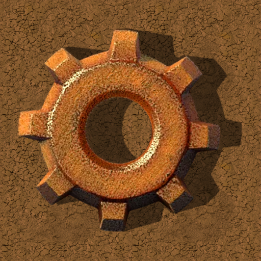

# Comfort Patch

**[Download it on the Factorio Mod Portal](https://mods.factorio.com/mod/Comfort_Patch)** · Factorio 2.0

**A quality-of-life patch that makes Factorio far more comfortable to play and
greatly speeds up your whole progression.**

> **⚠️ This mod is for casual players.** It does not try to rebalance the game — it just adds
> comfort. I personally do **not** think the base game recipes are wrong in any way; this is
> simply an "easy mode" for those who want a more relaxed factory.

Runs at `data-final-fixes`, so it applies **on top of** the base game,
any other mod: more generous recipes and batch
production, upgraded power and logistics, buffed quality modules, and a host of
tweaks across Nauvis and every Space Age planet. Every change is guarded, so if
an item is missing the tweak is simply skipped without breaking anything.

**Requires:** `base`, `space-age` (which also brings Quality).

---

## 🔩 Intermediates
- **Copper:** 1 plate → **4** cable
- **Steel:** 5 iron → **2** steel in **8 s**
- **Iron gears:** 2 iron → **2**
- **Circuits** — times: red **3s**, blue **5s**, LDS **3s**; outputs: green **4**, red **2**, blue **1** (just faster), LDS **2**
- **LDS:** 10 copper + 2 steel + 5 plastic → 2
- **Plastic** → 4 · **Landfill** 25 stone → 1 · **Stone wall** 5 brick → 2
- **Electric engine:** requires **2** engine units (+1) and produces **2** per craft (lubricant and circuits unchanged)
- **Space platform foundation:** 10 steel + 10 cable → **2**, **1,000 per rocket**

## 🌋 Foundry (casting)
- **Carbon** → 2
- **Casting from molten metal:** everything **×2** vanilla (iron/copper plates 4, steel 2, gears 2, sticks 8, cable 4, LDS 2, concrete 20)
- **Tungsten:** plate **×2** (stack 100), carbide **×3** (stack 200)

## 🤖 Logistics & construction
- **Belts** (red/blue/turbo): output **×2**
- **Cargo weights:** belts 1000, undergrounds 2000, splitters 2000
- **Robots:** stack 100, weight 1000; flying robot frame **×2**
- **Buffed roboports:** MK2 = 50 charging slots / 500 MJ buffer · MK3 = 100 slots / 1000 MJ · vanilla with a decent buffer
- **Robot batteries:** logistic 7 MJ, construction 5 MJ (includes modded robots)
- **Concrete** (normal/refined/hazard): stack and weight 1000

## 💥 Military
- **Ammo:** yellow **6**, red **4**, uranium **2**
- **Grenade** → 5 · **Tesla ammo** → 5 · **Explosives** → 8 · **Cliff explosives** → 10
- **Combat drones** (distractor / defender / destroyer) → **3** per craft and **last 5× longer** once deployed
- **Artillery:** new shell recipe (4 explosives + 1 calcite + 2 tungsten + 1 radar) that **yields 2 per craft**, stack 100; turret (100k) and wagon (200k) rocket weights
- **Equipment:** battery Mk3 and personal roboport Mk2 → **2** per craft

## 🎛️ Modules & quality
- **Tier 2 and 3** (speed/productivity/quality/efficiency): **×2** per craft
- **Quality chance buffed, with a correct progression:** Quality 1 **+2%**, Quality 2 **+4%**, Quality 3 **+6%** (vanilla: +1 / +2 / +2.5%); vanilla speed penalty kept

## ☢️ Nuclear power
- **Reactor:** **160 MW**, no neighbour bonus, consumption scales with quality
- **Uranium fuel cell:** **112 TJ**; no productivity on fuel cells or their reprocessing
- **Recipes** for heat exchanger and turbine at **10%** cost
- **Reactor:** max temperature **1500**, thermal buffer **20 GJ**
- **Heat exchanger:** **320 MW** at 1200 °C (much more steam)
- **Steam turbine:** **5500 MW**, 3/tick consumption
- **Hot-pipe boiler:** **×5** power
- **Heat pipe:** → **10** per craft
- Rocket cargo weights for every nuclear component

## 🪐 Space Age
- **Fulgora:** holmium solution 200 (vanilla plate), electrolyte 20, superconductor 3, supercapacitor in 5 s, carbon fiber 2
- **Gleba:** reworked *bioflux* (12 mash + 10 jelly → 5), artificial soils 20, fruit processing ×1.5 (6 jelly / 3 mash) + 5% seed, tweaked iron bacteria, nutrients from spoilage 2
- **Aquilo:** lithium plate 5, lithium from fluids only (50 brine + 100 ammonia), **⭐ lithium brine extraction ×50 (~100/s per pump)**, a reworked **fluoroketone loop** (heating outputs 200 hot; cooling is 50 → 50, temperatures preserved), and **quantum processor → 3** per craft in **5 s** (vanilla: 1 in 30 s; same ingredients, fluoroketone-hot byproduct preserved)
- **Fusion (cheaper):** reactor 100 tungsten / 50 superconductor / 25 supercapacitor / 100 quantum processor · generator 50 / 25 / 15 / 50 · fuel cell 3 lithium + 1 holmium + 50 ammonia
- **Cryogenic science:** needs **3** fluoroketone-cold (was 6), no longer returns fluoroketone-hot, and yields **2** packs per craft (was 1)
- **Orbit:** thruster with **2× thrust and half the consumption**; far more abundant thruster fuel and oxidizer; ice platform 25
- **Recycling:** *scrap recycling* with vanilla chances **×1.5**
- **Rocket fuel:** **7 s** and **2** per craft

## ⏳ Spoilage
- Everything **×3** vanilla: nutrients 15 min, pentapod egg 45 min, biter egg 90 min, agricultural science 3 h, bioflux 6 h

---

*An "easy mode" for casual players, not a rebalance. It stays generous without
breaking the game's logic: nothing is cheaper than its ingredients and every tier
still costs more than the last. Enjoy!*

---

☕ **Support my work**

Modding is a hobby I do in my spare time, just for the fun of it, and my mods are and will
always be free. If you enjoy them and feel like it, you can buy me a coffee:
[buymeacoffee.com/wolfenstain](https://buymeacoffee.com/wolfenstain)

No pressure at all: playing them and leaving feedback already means a lot. Thank you!

---

Questions? See the [FAQ](FAQ.md).
