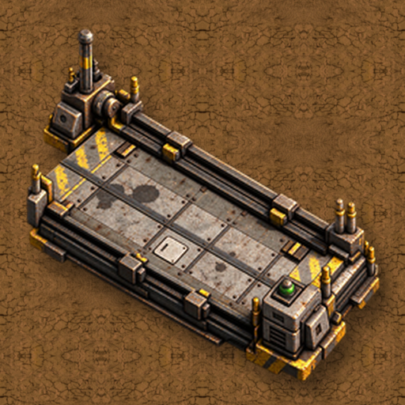
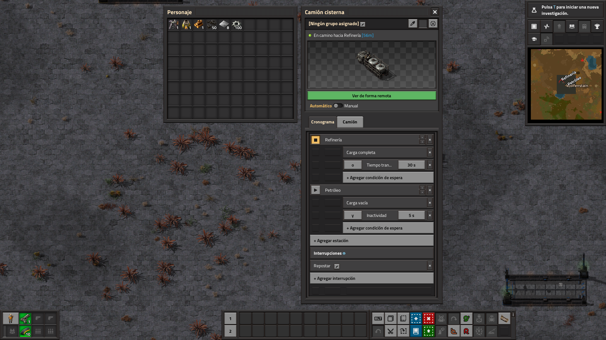
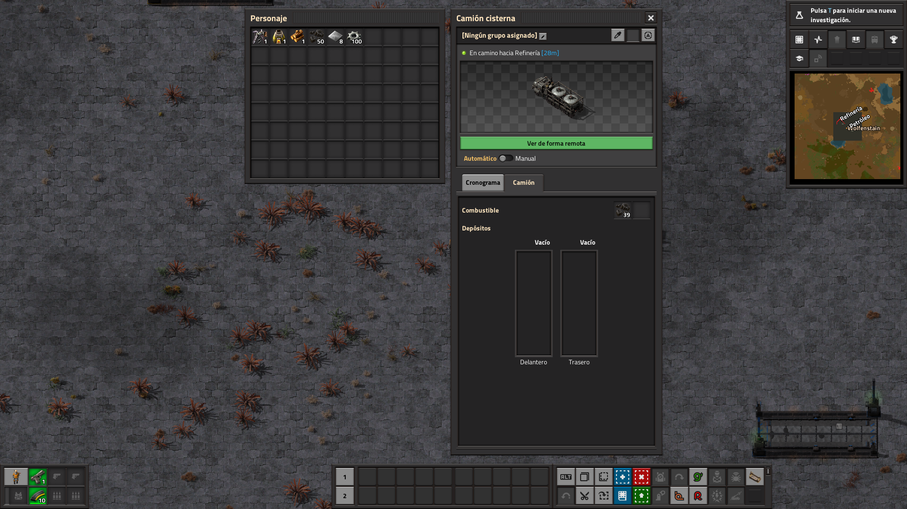
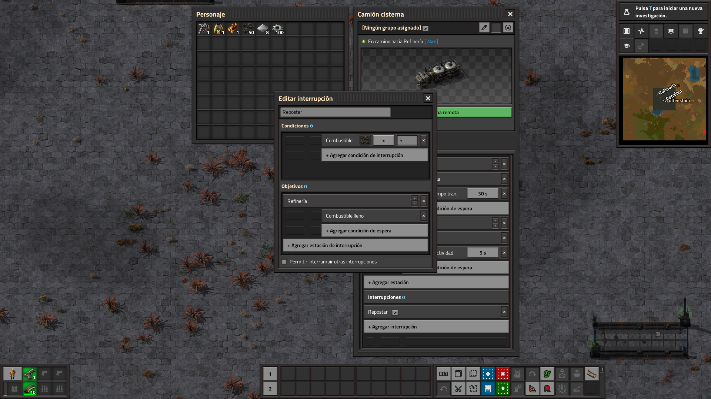
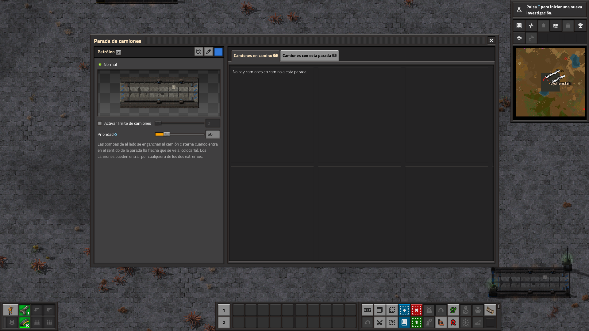
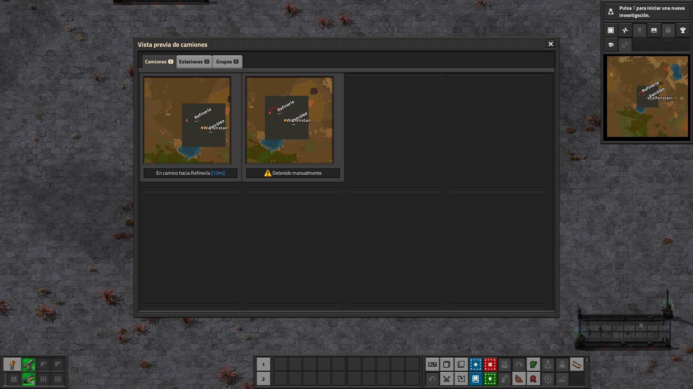
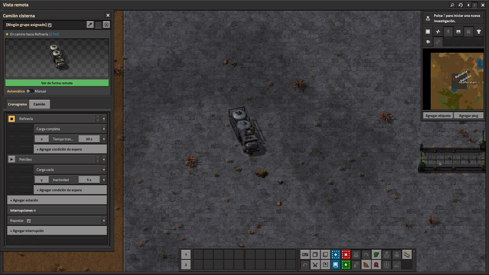

# Heavy Trucks: Autopilot

**[Download it on the Factorio Mod Portal](https://mods.factorio.com/mod/heavy-trucks-autopilot)** · Factorio 2.0

**The trucks of [Heavy Trucks (Vanilla+)](https://mods.factorio.com/mod/heavy-trucks) drive themselves
between truck stops, following a schedule, just like trains.**

It's a dependency of Heavy Trucks and installs automatically: research **Heavy logistics**, build
**truck stops** and give your trucks a schedule.

---

## Truck stops and schedules

- **Truck stops** work like train stops: name them, set a **truck limit** and a **priority**, and
  connect them to the circuit network. Several stops in a row work as one lane.
- Every truck gets a **Schedule** tab, like a locomotive's: stops with their **wait conditions**
  (full or empty cargo, time, inactivity, item and fluid counts), **temporary stops**,
  **interrupts** and **truck groups** that share one schedule.
- A stop with **no wait conditions** is a waypoint: the truck drives through it and carries on.
- Switch the truck to **Automatic** and it goes. Get in and drive it yourself at any time: the
  autopilot waits, and carries on when you leave it.
- **Drive remotely** from the truck window: remote view on the truck, with you at the wheel.

## Roads

Trucks **use the roads you build** when one takes them where they're going, and drive across
country when there's none. There's nothing to mark: roads are found by how they're drawn.

- A road is the space between **two yellow lines of hazard concrete**, a **strip of hazard
  concrete**, or a **street of paving** (concrete, stone path...) with something else either side:
  5 to 12 tiles wide, straight, at least 16 tiles long. Two-lane roads with a line down the middle
  work too.
- Trucks keep to the **right**, slow down at crossings and round the corners.
- Roads from **Transport Drones**, and tiles other mods mark as roads, count too.
- Turn it off for the whole map (**Trucks use roads**) or for one truck (**Use roads**).

## Driving like a real truck

- Trucks slow down for their turning circle, never drive faster than they can stop, give way to
  each other and **open gates**.
- **Headlights and taillights** come on at night while the autopilot drives.
- A truck that gets stuck backs off and plans a new route by itself.

## Cargo

- **Slot filters**, like a cargo wagon: middle-click a slot to filter it.
- **Trunk limit**, like a chest: the red button next to "Trunk".

## Performance

Only trucks that are driving cost anything. There are no periodic searches of the map, so a big
map with no trucks costs nothing.

---

Works with Factorio 2.0. Feedback and bug reports are welcome in the Discussion tab: a screenshot
or a save of a truck that did something odd helps a lot.

---

☕ **Support my work**

Modding is a hobby I do in my spare time, just for the fun of it, and my mods are and will
always be free. If you enjoy them and feel like it, you can buy me a coffee:
[buymeacoffee.com/wolfenstain](https://buymeacoffee.com/wolfenstain)

No pressure at all: playing them and leaving feedback already means a lot. Thank you!

---

## Gallery

---

Questions? See the [FAQ](FAQ.md).
