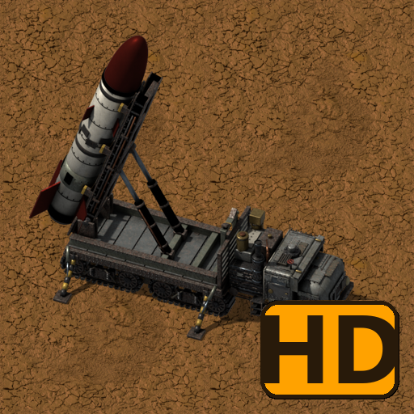

# Heavy Trucks (Vanilla+): HD graphics Part 2

**[Download it on the Factorio Mod Portal](https://mods.factorio.com/mod/heavy-trucks-hd-part-2)** · Factorio 2.0

**Optional high-resolution graphics for the newer trucks of [Heavy Trucks (Vanilla+)](https://mods.factorio.com/mod/heavy-trucks): the V3 Launcher and the Radar Truck.**

The trucks as they were rendered, at twice the resolution of the standard graphics that come with
Heavy Trucks. Just enable this mod: Heavy Trucks uses these graphics automatically. Nothing else
changes: no new items, recipes or settings.

## Why "Part 2"?

The mod portal limits the size of each mod, and the HD graphics of every truck no longer fit in one.
So they come in two optional mods:

- **Heavy Trucks (Vanilla+): HD graphics**: the Heavy, Tanker, Artillery and Logistic trucks.
- **Heavy Trucks (Vanilla+): HD graphics Part 2** (this one): the V3 Launcher and the Radar Truck.

Use one, both or none: each truck without its HD mod simply uses the standard graphics.

**Requires:** Heavy Trucks (Vanilla+) 1.3.0 or newer.

---

☕ **Support my work**

Modding is a hobby I do in my spare time, just for the fun of it, and my mods are and will
always be free. If you enjoy them and feel like it, you can buy me a coffee:
[buymeacoffee.com/wolfenstain](https://buymeacoffee.com/wolfenstain)

No pressure at all: playing them and leaving feedback already means a lot. Thank you!

Licence: see [LICENSE.md](LICENSE.md).
