# Heavy Trucks (Vanilla+)

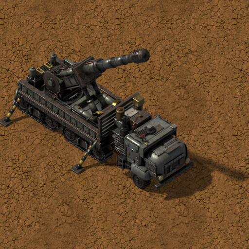

**[Download it on the Factorio Mod Portal](https://mods.factorio.com/mod/heavy-trucks)** · Factorio 2.0 · [Español](README.es.md)

Four half-track heavy trucks built to look like they came straight from Wube: same camera,
same materials, rendered in 64 directions with animated tracks, lights, shadows and their
own wrecks. They all share the same tractor unit and each one carries a different job on its bed.

Works with Factorio 2.0. **Space Age is optional.**

---

## Heavy Truck

The workhorse and the base of the other trucks.

- **160-slot** cargo bed. Its deck **fills up with cargo** as the trunk does (it can be hidden in the per-player settings).
- **Recipe:** 32 engine units, 10 electronic circuits, 50 iron plates, 100 steel plates.
- **Research:** Heavy truck (red + green science, after Automobilism).

## Tanker Truck

A fluid wagon on the road.

- **Two isolated tanks of 25,000** each (front and rear), so it can carry two different fluids.
- Park it next to an **ordinary pump**: the vanilla connector arm reaches out to the tank
  valve, just like with a fluid wagon. Pump towards the truck to fill it, away to empty it.
  Each tank can be served from either side, with the pump on either side of the valve.
- Moving the truck disconnects it instantly.
- Its window shows the fuel and one bar per tank in the colour of its fluid.
- **Recipe:** 1 Heavy truck, 5 advanced circuits, 2 storage tanks, 5 engine units, 15 plastic bars.
- **Research:** red + green + blue science, after Fluid handling.

## Artillery Truck

Mobile long-range artillery.

- **Deploy** it when stopped (button in its window or **Shift + G**): four stabilizers plant on
  the ground and the gun rises. It cannot be driven while anchored. Fold it the same way.
- Fires **vanilla artillery shells** (any ammo of the artillery-shell category) in a
  **70° cone ahead**, with **half the range of the artillery wagon** (112, minimum 32).
  Artillery range, shooting speed and damage research all apply.
- **Manual fire** by the driver: the shoot key, or the **targeting tool (Shift + T or the
  shortcut bar)**, which also works **from the map** and shows the range cone.
- **Automatic fire:** a switch in its window; when deployed it fires on its own at enemy
  spawners and worms inside its cone.
- The artillery targeting remote does not command it: it is a truck you drive and aim.
- Holds up to **100 shells** of one type, loaded from its window (no trunk).
- **Recipe:** 1 Heavy truck, 1 artillery turret, 1 radar, 5 processing units
  (+ 10 tungsten plates and 5 tungsten carbide with Space Age).
- **Research:** the artillery science packs, after Artillery.

## Logistic Truck

A mobile logistics hub.

- Carries a **compact roboport** (1 robot slot + 1 repair pack slot, logistics radius 25,
  construction radius 50) and the **five logistic chests** (passive and active provider,
  storage, requester and buffer), **5 slots each**, plus a small **20-slot trunk**.
- **Its network travels with it and keeps working while driving**; robots follow the truck.
  When it overlaps your network they merge, and the game picks the closest chest and
  robots, so the truck serves whatever is near it.
- **Self-powered:** its solar panels (as much as 10 vanilla ones) charge a **50 MJ battery**
  (10 accumulators). Parked within reach of a power pole, it also charges from the grid.
  The vanilla "no power" icon appears if it runs low.
- Robots come and go through the **roboport iris hatch**, which opens like the real one,
  and the antenna spins.
- A panel next to the car window shows the roboport, the battery and the five chests; each
  chest opens its own vanilla window to set requests.
- **Recipe:** 1 Heavy truck, 1 roboport, 5 steel chests, 10 solar panels, 10 accumulators,
  5 advanced circuits, 15 electronic circuits.
- **Research:** after Logistic system.

## Radar Truck

A radar on wheels.

- **Driving**, it has the **range of the game's radar**.
- **Stopped**, raise its mast (button in its window or **Shift + G**): the antenna goes up and the
  stairs come down, for **twice the range**. It can't be driven while the mast is up.
- Runs on its own **solar panels and battery**, and charges from the **electric grid** when parked
  within reach of a pole.
- **Recipe:** 1 Heavy truck, 10 accumulators, 10 solar panels, 1 radar, 10 advanced circuits,
  20 electronic circuits.
- **Research:** red, green and blue science, after the Heavy truck, Advanced circuits, Solar energy and
  Electric energy accumulators.

## V3 Launcher (Space Age)

A late-game mobile launcher for one enormous missile, inspired by the V3 of Red Alert 2.

- Used **exactly like the Artillery Truck**: deploy it when stopped (**Shift + G**), the four
  stabilizers plant and the launcher raises the missile; fire it by hand (shoot key or the
  **targeting tool, Shift + T**, also from the map) or in **automatic mode** with target priorities.
- Launches in a **70° cone ahead** with **more range than the artillery wagon** (300, minimum 48;
  artillery range research applies).
- The missile climbs high, steers towards the target trailing smoke and lands with an
  **enormous explosion** (10-tile radius), destroying cliffs too.
- Carries **one missile at a time**, visible on its ramp (also while driving); load it by hand, with
  **Ctrl / Shift + click** or with **inserters**. Its nose and fins take the truck's colour.
- On the map, the missile is seen flying like an artillery shell, and the impact area is revealed live.
- **V3 missile recipe:** 10 rocket fuel, 10 explosives, 5 low density structures,
  5 advanced circuits, 10 steel plates.
- **Recipe:** 1 Heavy truck, 10 quantum processors, 50 lithium plates, 20 tungsten plates,
  20 low density structures, 20 processing units.
- **Research:** all science packs up to cryogenic, after Artillery and Quantum processor.

---

## Quality

Quality trucks are better, like the game's train wagons:

- **All trucks:** +10 % engine power per quality level (faster acceleration and top speed) and −5 % fuel per level. Legendary: ×1.5 power, ×0.75 fuel.
- **Tanker Truck:** bigger tanks, like the fluid wagon (legendary: 62,500 each).
- **Artillery Truck:** longer range, like the artillery wagon (legendary: +50 %).
- **Logistic Truck:** its chests get more slots (legendary: 12). The roboport stays the same, as quality doesn't change the game's roboports either.

## Settings

Every truck except the Heavy Truck can be switched off with a **startup setting**. Each player can hide the Heavy Truck's cargo with a **per-player setting**.

## Credits

Made by **Wolfenstain**.

Licensed under [CC BY-NC-ND 4.0](https://creativecommons.org/licenses/by-nc-nd/4.0/): free to use and share, no commercial use, no modified versions.

---

☕ **Support my work**

Modding is a hobby I do in my spare time, just for the fun of it, and my mods are and will
always be free. If you enjoy them and feel like it, you can buy me a coffee:
[buymeacoffee.com/wolfenstain](https://buymeacoffee.com/wolfenstain)

No pressure at all: playing them and leaving feedback already means a lot. Thank you!

---

## Gallery

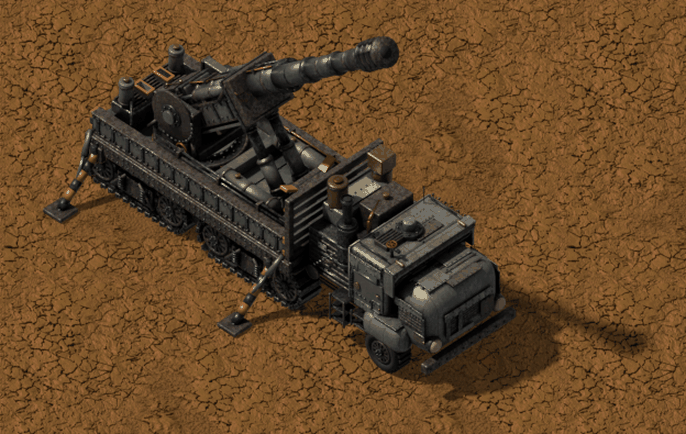

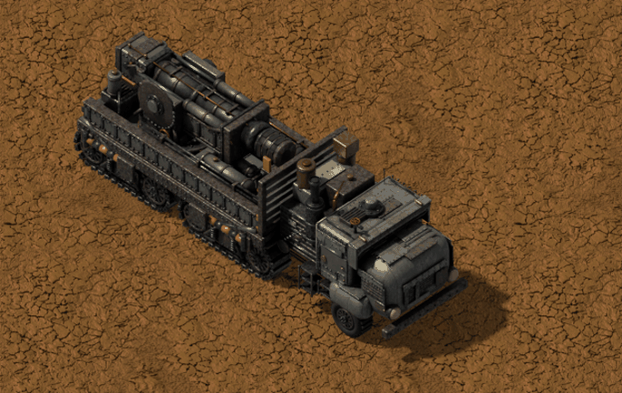

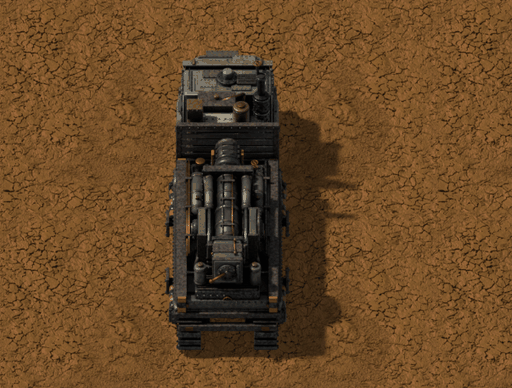

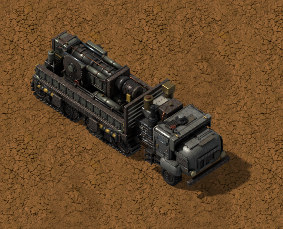

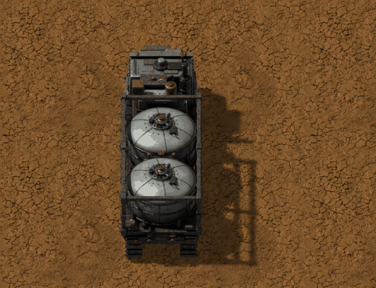

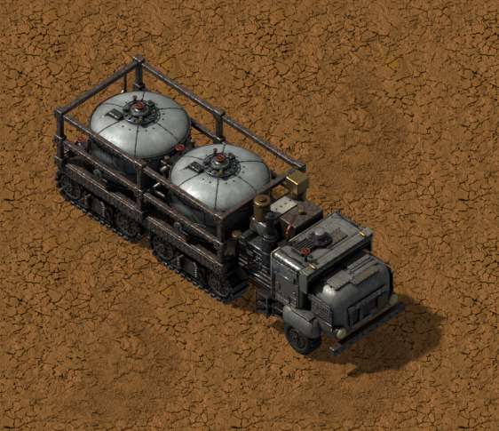

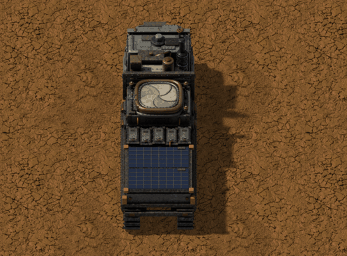

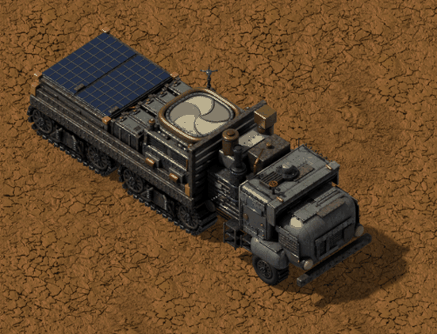

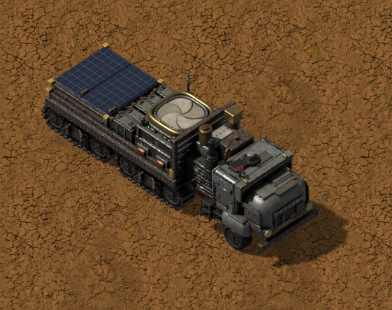

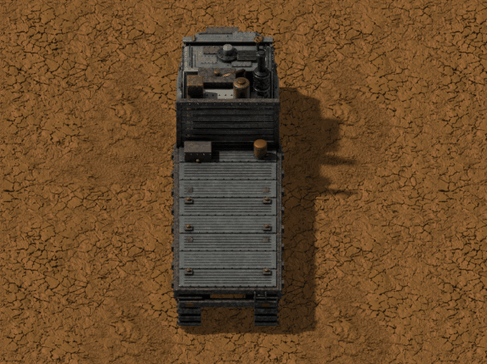

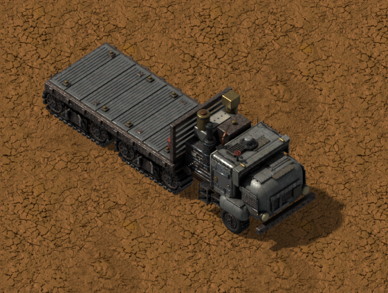

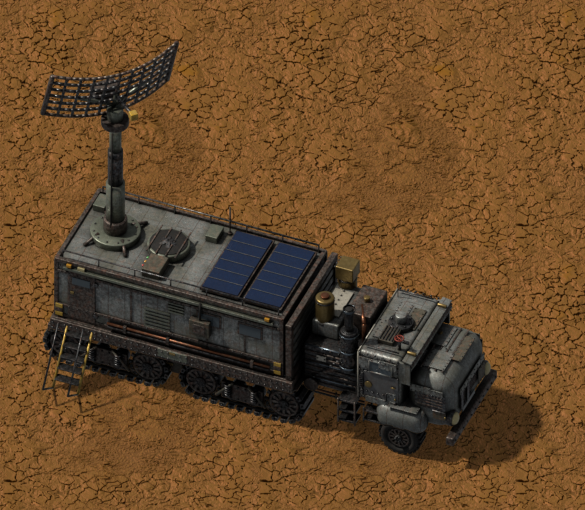

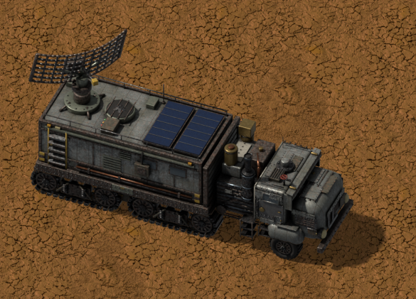

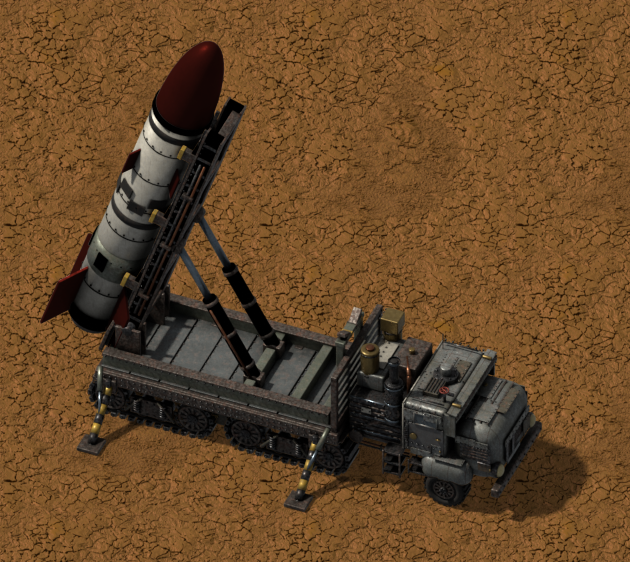

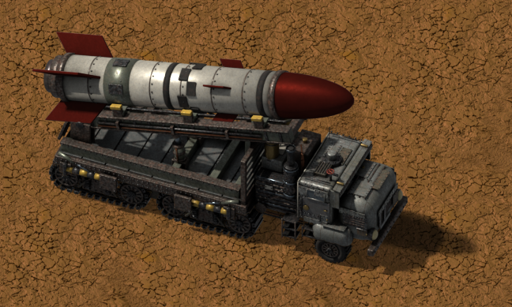

---

Questions? See the [FAQ](FAQ.md).

Licence: see [LICENSE.md](LICENSE.md).
