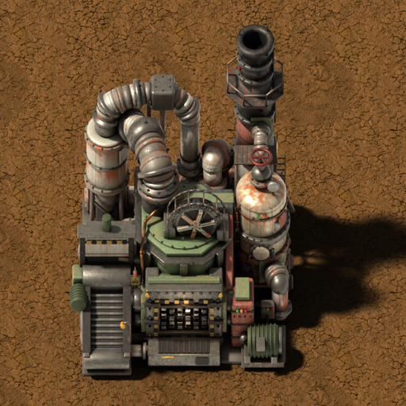

# Industrial Shredder (Vanilla+)

**[Descárgalo en el portal de mods de Factorio](https://mods.factorio.com/mod/industrial-shredder)** · [English](README.md)

Una máquina grande y bruta de 5×5 para **deshacerte de lo que te sobra**. Échale cualquier objeto
y queda hecho nada; métele cualquier fluido por tubería y se quema en su chimenea.
**No sale nada más que contaminación.**

Se acabaron los cofres llenos de basura y los tanques que no hay forma de vaciar.

Gráficos renderizados al estilo de los edificios del juego, a su misma resolución, con sonidos
vanilla. Funciona con o sin Space Age.

---

## Objetos

- **Cualquier objeto** entra con insertadores (o a mano): la trituradora elige sola la receta, como
  el reciclador, y lo destruye.
- **4 objetos por segundo** a velocidad base. Módulos: velocidad, eficiencia y contaminación.
- Se genera sola una receta "Triturar X" para **todos los objetos del juego**, también los de otros
  mods.
- Mientras tritura: la cinta de entrada avanza cargada con **tanta chatarra como quede por triturar**
  (rocas, chapas, tubos, engranajes...), giran los rodillos y el volante, vibran las tuberías, sale **humo
  blanco** por la chimenea y las luces de la boca se ponen **rojas** → **amarillas** con los
  últimos objetos → **verdes** al terminar.

## Fluidos

- Una entrada de fluido en el costado, con la conexión de tubería del propio juego.
- **Cualquier fluido** que entre se quema a **200 unidades por segundo** mientras tenga corriente.
- Mientras quema: vibran las tuberías y el depósito y sale **humo negro** por la chimenea.

## Contaminación

- **12 por minuto** mientras tritura, más la de cada unidad de fluido quemada.

## Receta e investigación

- **Receta:** 50 placas de hierro, 25 de acero, 20 tuberías, 15 placas de cobre, 15 circuitos
  electrónicos y 10 circuitos avanzados.
- **Investigación:** *Trituradora industrial*, tras *Circuitos avanzados*, 150 de ciencia roja y verde.
- 400 kW, 2 huecos de módulo.

---

Gráficos a resolución estándar (32 px por casilla). Sugerencias y fallos, en la pestaña Discussion.

---

☕ **Apoya mi trabajo**

Hacer mods es un hobby que hago en mi tiempo libre, por puro gusto, y mis mods son y serán
siempre gratuitos. Si te gustan y te apetece, puedes invitarme a un café:
[buymeacoffee.com/wolfenstain](https://buymeacoffee.com/wolfenstain)

Sin ningún compromiso: que los juegues y me dejes tus comentarios ya significa mucho. ¡Gracias!
