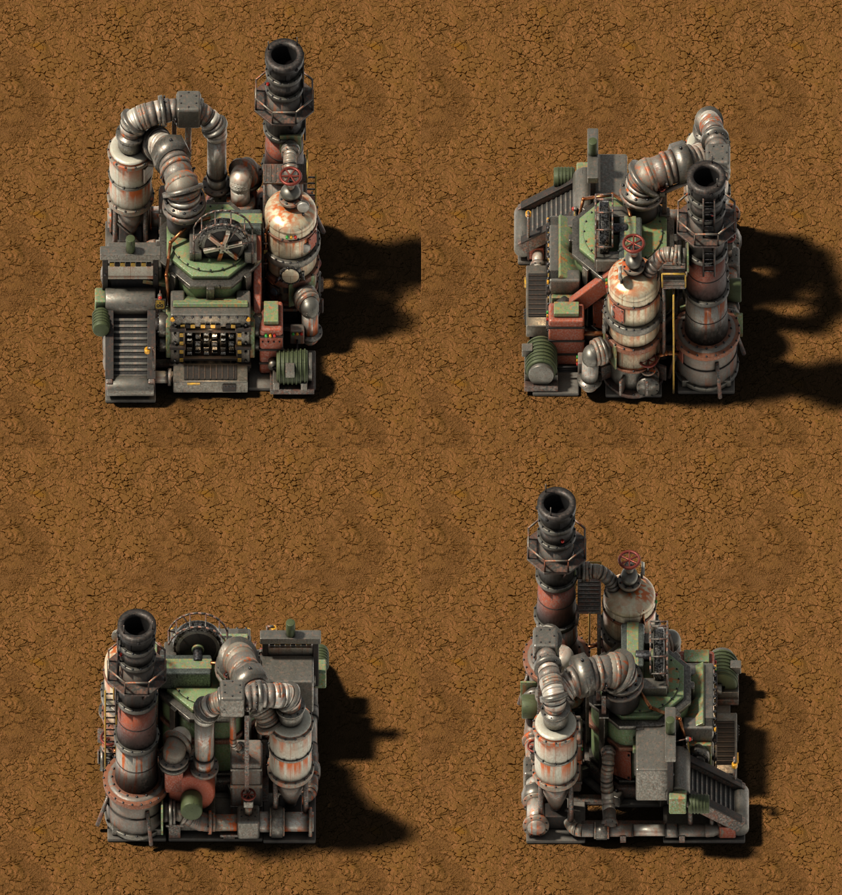
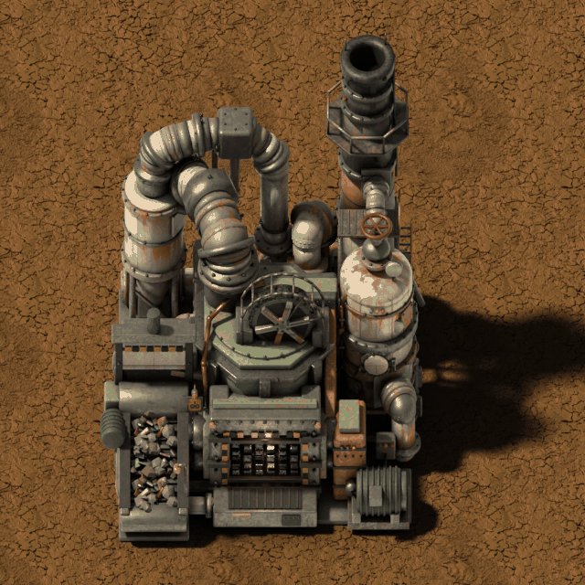

# Industrial Shredder (Vanilla+)

**[Download it on the Factorio Mod Portal](https://mods.factorio.com/mod/industrial-shredder)** · Factorio 2.0 · [Español](README.es.md)

A big, brutal 5×5 machine to **get rid of whatever you don't want**. Feed it any item and it is
shredded to nothing; pipe any fluid into it and it is burned off in its chimney.
**Nothing comes out but pollution.**

No more chests full of junk, no more tanks you can't empty: the shredder takes it all.

Graphics rendered to look like the game's own buildings, at the game's own resolution, with
vanilla sounds. Works with or without Space Age.

---

## Items

- Put **any item** in by inserter (or by hand): the shredder picks the right recipe by itself,
  like the recycler does, and destroys it.
- **4 items per second** at base speed. Modules: speed, efficiency and pollution.
- One "Shred X" recipe is generated automatically for **every item in the game**, including the
  ones from other mods.
- While shredding: the feed belt runs loaded with **as much scrap as is left to shred** (rocks, plates,
  pipes, gears...), the rollers and flywheel turn, the pipes shake, **white smoke** comes out
  of the chimney and the status lamps by the mouth go **red** → **yellow** with the last few items →
  **green** when it has finished.

## Fluids

- One fluid input on the side, with the game's own pipe connection.
- **Any fluid** piped in is burned off at **200 units per second** while the shredder has power.
- While burning: the pipes and the tank shake and **black smoke** comes out of the chimney.

## Pollution

- **12 per minute** while shredding, plus the pollution of every fluid unit burned.

## Recipe and research

- **Recipe:** 50 iron plates, 25 steel plates, 20 pipes, 15 copper plates, 15 electronic circuits,
  10 advanced circuits.
- **Research:** *Industrial shredder*, after *Advanced circuit*, 150 × red and green science.
- 400 kW, 2 module slots.

---

Standard-resolution graphics (32 px per tile). Feedback and bug reports are welcome in the
Discussion tab.

---

☕ **Support my work**

Modding is a hobby I do in my spare time, just for the fun of it, and my mods are and will
always be free. If you enjoy them and feel like it, you can buy me a coffee:
[buymeacoffee.com/wolfenstain](https://buymeacoffee.com/wolfenstain)

No pressure at all: playing them and leaving feedback already means a lot. Thank you!

---

## Gallery

---

Questions? See the [FAQ](FAQ.md).

Licence: see [LICENSE.md](LICENSE.md).
