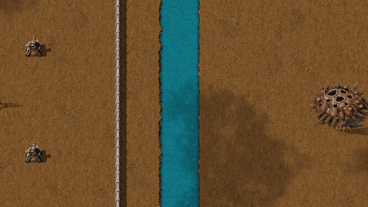

# New Enemies (Vanilla+)

**[Download it on the Factorio Mod Portal](https://mods.factorio.com/mod/new-enemies)** · Factorio 2.0

New enemies for Nauvis. Rendered in the game's own style, with vanilla-like animations and evolution colours.

This is the **first release** of the pack: it brings the **Flyers**. More families are on the way.

---

## Flyers

Biters that learned to fly. Your walls won't stop them.

- **Four evolution tiers**, like the vanilla biters: small, medium, big and behemoth flyers.
- **They fly straight over walls, water and cliffs**: the defences that keep biters out don't
  keep flyers out.
- **Regular turrets can't hit them in the air.** Only anti-air turrets can. If one shoots a
  flyer, the flyer comes for it: it flies over, lands beside the turret and attacks it.
- **They land when they wait** and **fight on the ground**: once landed, every turret can shoot
  them like any biter.
- They take off and land with their own animations, and fall out of the sky when shot down.
- Health, damage and resistances follow the vanilla biter of the same tier.

### Flyer nest

Flyers hatch in their own nest: a low, spiky mound with large incubation cavities on top.

- It shows up **next to enemy bases**, a bit further from the starting area: newly explored
  areas and bases founded by expansion get them too.
- **Safe to add to a game in progress** (flyer nests are added once to the existing bases, never
  near your buildings) **and to remove** (every enemy base keeps its vanilla nests).
- Its flyers **hatch airborne** and follow the same evolution as biters: small at first, then
  medium, big and behemoth.
- It absorbs pollution and sends attacks just like a vanilla spawner.

### Turret priorities

Flyers appear once per tier in the turret **priority list**: pick one and it counts both in the
air (anti-air turrets) and on the ground (every turret).

---

## Coming next

- **Brutes**: big, heavily armoured biters built to break through defences.
- **Titans**: rare, special and **very dangerous** creatures that show up as the game goes on.

  You'll want to be ready for them.

## Recommended: New Turrets (Vanilla+)

**New Turrets** is the companion mod, and it's **recommended** to play New Enemies with it:
its defences are designed to answer the new threats. The first is the **Prism Tower**, inspired
by Command & Conquer: Red Alert 2, and **anti-air turrets** are on the way to take the flyers
down before they land. With Space Age, New Turrets also lets the **rocket turret** shoot flyers
in the air.

## Part of something bigger

New Enemies is part of a **future modpack that adds a new stage of progression** to the game,
with **a new planet**: tougher enemies, and the defences and tools to deal with them. For now it
works on its own, and its enemies live on Nauvis: just add it to your game.

---

Works with Factorio 2.0; Space Age is not required. Feedback and bug reports are welcome in the
Discussion tab.

**For modders:** to let a turret shoot flyers in the air, add `"flying-robot"` (or `"air-unit"`)
to its `attack_target_mask` in `data.lua` or `data-updates.lua`. Turrets that don't declare it
ignore flyers while they fly.

---

☕ **Support my work**

Modding is a hobby I do in my spare time, just for the fun of it, and my mods are and will
always be free. If you enjoy them and feel like it, you can buy me a coffee:
[buymeacoffee.com/wolfenstain](https://buymeacoffee.com/wolfenstain)

No pressure at all: playing them and leaving feedback already means a lot. Thank you!

---

## Gallery

---

Questions? See the [FAQ](FAQ.md).
