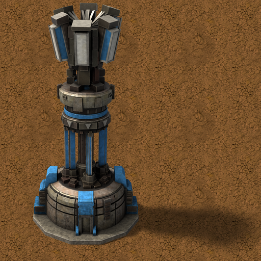

# New Turrets (Vanilla+)

**[Download it on the Factorio Mod Portal](https://mods.factorio.com/mod/simple-turrets)** · Factorio 2.0

New defensive towers in the vanilla style, rendered to look like they came from Wube, with
vanilla-like animations, sounds and player-colour masks.

This is the **first release**: it brings the **Prism Tower**. More defences are on the way,
including **anti-air turrets**.

---

## Prism Tower

Inspired by the Prism Tower of Command & Conquer: Red Alert 2.

- It **charges up and fires a focused beam of white light**.
- **Weak on its own, deadly in numbers:** nearby idle prism towers **link up in a chain** and feed
  their energy into one shot, **multiplying its damage up to ×5**. Place them close together.
- The crown of prisms spins while idle, stops to charge and fire, and takes your **player colour**.
- **Range 26**, **800 health**, powered by electricity. Without power it stops.
- **Prism damage:** enemies resist it like laser, but only its own research improves it:
  **Prism damage**, 6 levels plus an infinite one.

### Recipe and research

- **Reflective prism** (its crafting material), made in a chemical plant from plastic, copper
  and sulfuric acid.
- **Prism tower:** 8 reflective prisms, 40 steel plates, 15 advanced circuits, 20 batteries.
- **Research:** *Prism tower*, after *Laser turret* and *Sulfur processing*.

**With Space Age** it becomes late-game: the reflective prism is made from holmium and lithium in
the electromagnetic plant, the tower needs tungsten, processing units, superconductors and
supercapacitors, and the research comes after the cryogenic science pack.

---

## Rocket turret vs. flyers (Space Age)

With **Space Age**, New Turrets lets the vanilla **rocket turret** shoot **flyers** from
New Enemies while they're in the air.

## Coming next

- **Anti-air turrets**, to take flyers down before they land.
- More towers, each one designed to answer a new threat.

## Made for New Enemies

New Turrets is the companion mod of **New Enemies (Vanilla+)**: its defences are designed for
the new enemies. It also works on its own, against the vanilla biters.

Both are part of a **future modpack that adds a new stage of progression** to the game, with
**a new planet**.

---

Works with Factorio 2.0; Space Age is optional. Feedback and bug reports are welcome in the
Discussion tab.

---

☕ **Support my work**

Modding is a hobby I do in my spare time, just for the fun of it, and my mods are and will
always be free. If you enjoy them and feel like it, you can buy me a coffee:
[buymeacoffee.com/wolfenstain](https://buymeacoffee.com/wolfenstain)

No pressure at all: playing them and leaving feedback already means a lot. Thank you!

---

Questions? See the [FAQ](FAQ.md).

Licence: see [LICENSE.md](LICENSE.md).
