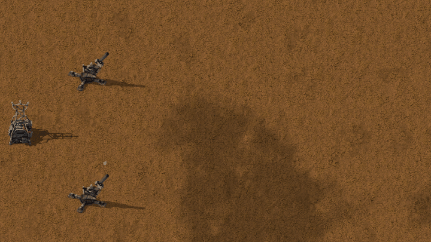
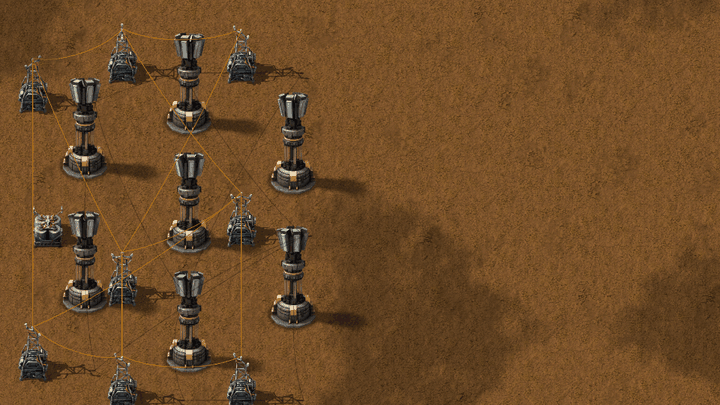

# New Turrets (Vanilla+)

**[Download it on the Factorio Mod Portal](https://mods.factorio.com/mod/simple-turrets)** · Factorio 2.0

New defensive towers in the vanilla style, rendered to look like they came from Wube, with
vanilla-like animations, sounds and player-colour masks.

It brings the **Prism Tower** and the **Flak Cannon**, an anti-air turret.
More defences are on the way.

---

## Prism Tower

Inspired by the Prism Tower of Command & Conquer: Red Alert 2.

- It **charges up and fires a focused beam of white light**.
- **Strong on its own, devastating in numbers:** nearby idle prism towers **link up in a chain** and
  feed their energy into one shot: **each linked tower adds +150 %** of its damage, with **up to 8
  supporting towers** (a full chain of 9 hits 13 times as hard). Place them close together.
- The crown of prisms spins while idle, stops to charge and fire, and its prisms light up as it charges. The base and the beam take your **player colour**.
- **Range 26**, **1200 health**, powered by electricity. Without power it stops.
- **Prism damage:** enemies resist it like laser, but only its own research improves it:
  **Prism damage**, 6 levels plus an infinite one.

### Recipe and research

- **Reflective prism** (its crafting material), made in a chemical plant from plastic, copper
  and sulfuric acid.
- **Prism tower:** 8 reflective prisms, 40 steel plates, 15 advanced circuits, 20 batteries.
- **Research:** *Prism tower*, after *Laser turret* and *Sulfur processing*.

**With Space Age** it becomes late-game: the reflective prism is made from holmium and lithium in
the electromagnetic plant, the tower needs tungsten, processing units, superconductors and
supercapacitors, and the research comes after the cryogenic science pack.

---

## Flak Cannon

Inspired by the Flak Cannon of Command & Conquer: Red Alert 2.

- **Anti-air only:** it shoots **flying enemies** (the flyers of New Enemies while they fly) and
  **never anything on the ground**, not even a flyer that has landed.
- **2 shots a second**, **range 36**. Every shot bursts in the air around its target and hits
  **everything flying within 2 tiles** (30 explosion damage).
- **500 health**, 3×3, powered by electricity: no ammo.
- Made from two parts: the **flak cannon barrel** (10 steel, 20 iron plates, 5 engine units) and
  the **flak cannon mount** (4 iron sticks, 4 steel plates, 1 iron gear wheel).
- **Research:** *Flak cannon*, after *Military 3*.

**With Space Age** its parts take tungsten from **Vulcanus** (5 tungsten plates in the barrel,
4 tungsten carbide in the mount) and it's researched with the metallurgic science pack.

---

## Coming next

- More towers, each one designed to answer a new threat.

## Made for New Enemies

New Turrets is the companion mod of **New Enemies (Vanilla+)**: its defences are designed for
the new enemies. It also works on its own, against the vanilla biters.

Both are part of a **future modpack that adds a new stage of progression** to the game, with
**a new planet**.

---

Works with Factorio 2.0; Space Age is optional. Feedback and bug reports are welcome in the
Discussion tab.

---

☕ **Support my work**

Modding is a hobby I do in my spare time, just for the fun of it, and my mods are and will
always be free. If you enjoy them and feel like it, you can buy me a coffee:
[buymeacoffee.com/wolfenstain](https://buymeacoffee.com/wolfenstain)

No pressure at all: playing them and leaving feedback already means a lot. Thank you!

---

## Gallery

---

Questions? See the [FAQ](FAQ.md).

Licence: see [LICENSE.md](LICENSE.md).
