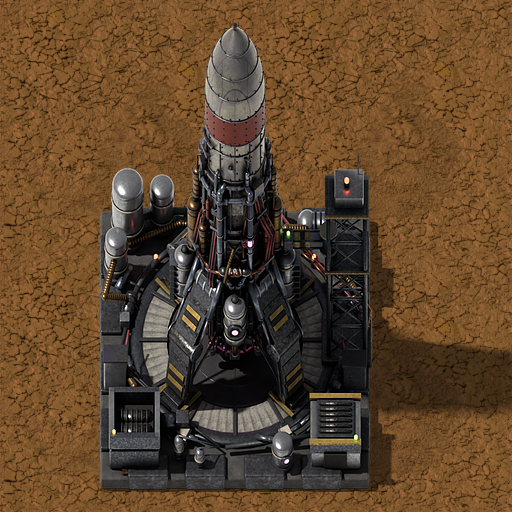
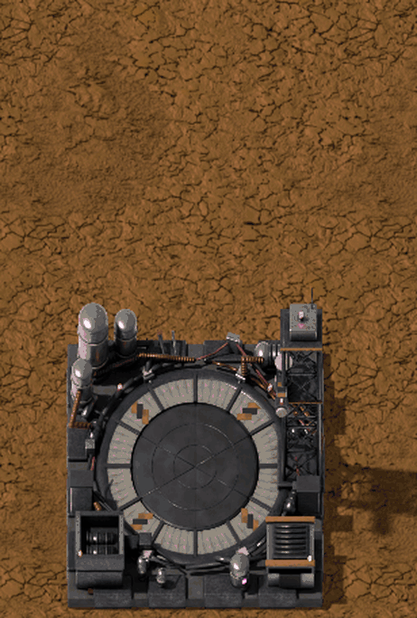
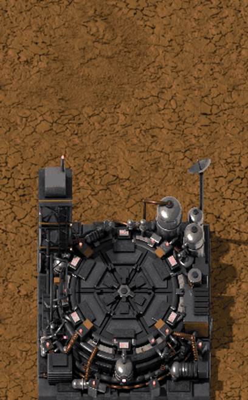
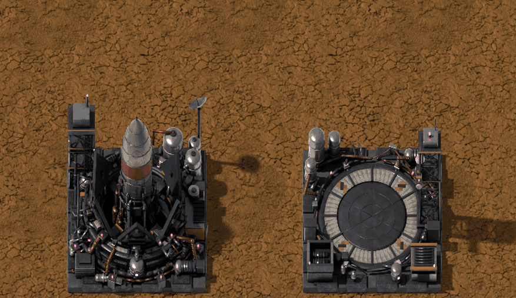

# Simple Rockets (Vanilla+)

**[Download it on the Factorio Mod Portal](https://mods.factorio.com/mod/simple-rockets)** · Factorio 2.0 · [Español](README.es.md)

Small, powerful one-way rockets that carry what you ask for **straight from one planet to
another**, without a space platform. Build a silo on the planet that has the items and a landing
pad on the planet that needs them: the pad asks, the silo gathers it from its logistic network,
launches, and the rocket lands on the pad a few minutes later.

They don't replace space platforms: they're a fast, direct way to send urgent cargo (up to 1 ton per rocket) between planets.

Requires **Space Age**. Graphics rendered to look like the game's own, with vanilla sounds.

---

## Simple rocket silo (6×6)

- Builds a rocket from **5 simple rocket parts** (1 heat shield, 1 guidance computer,
  1 cryogenic fuselage and 1 cryogenic fuel each).
- **Destination:** *Automatic* (the default) or one landing pad. In automatic, pads are served in
  the order they have been waiting; each pad is given the silo whose logistic network already
  has what it's missing, then the closest one, then the one that has waited longest.
- The silo asks its logistic network for the pad's missing items (like the vanilla silo for
  space platforms) and, like the game's launches to platforms, **only sends full rockets**: full,
  or holding everything the pad asks for when that's less.
- **It never takes off without a route**: with nowhere to go, the rocket waits in the shaft.
- Silos have **names** ("Rocket silo 1", "Rocket silo 2"...), editable with the pencil in their panel.

- **Recipe:** 500 refined concrete, 100 tungsten plates, 100 processing units,
  50 superconductors, 50 low density structures, 5 quantum processors.

## Landing pad (6×6)

- Its own panel, on the right of its window: its **requests for the rockets** (item, quality,
  amount and the **planet to import it from**, like a space platform's) are what the silos send.
- The panel also shows the **silos getting a rocket ready** for it (planet, name, what they're doing
  and what they'll carry), what is **still to be sent**, and the **rockets on their way**.
- In a logistic network it works like a **passive provider chest**: robots can take what it holds,
  but never bring it anything.
- An editable **name** (the pencil, like a train stop), shown in the silo's destination list.
- **"Only receive what it asks for"**: the pad only receives what it asks for.
- The rocket comes down braking on its jet, opens its legs and lands. The service tower's
  **umbilical arm** locks on and unloads it into the pad, then the **elevator** takes it down the
  shaft, where it is taken apart into **rocket scrap**, and comes back up empty.
- Several rockets arriving at once land one after another.

- **Recipe:** 500 refined concrete, 100 tungsten plates, 50 processing units,
  20 superconductors, 5 quantum processors.

## Flights

- Fixed speed: **450 km/s**, **+15 km/s per level** of the infinite *Simple rocket speed*
  research. Nauvis → Aquilo takes about 1:40.
- Rockets in flight show in the silo and landing pad windows, with their destination and the time left.
- A flight can be **called off** (the cross on it): the rocket turns back and lands on the freest
  landing pad of the planet it left; with none there, its cargo goes back into its silo.

## Rocket materials

Each one is made on its planet, in that planet's machine:

| Material | Where | Ingredients |
|---|---|---|
| Tungsten heat shield | Vulcanus, foundry | tungsten carbide, tungsten plate, molten copper |
| Guidance computer | Fulgora, electromagnetic plant | supercapacitor, superconductor, processing unit |
| Cryogenic fuselage | Aquilo, cryogenic plant | lithium plate, carbon fiber, cold fluoroketone |
| Cryogenic fuel | Aquilo, cryogenic plant | rocket fuel, ammonia, cold fluoroketone |

**Rocket scrap** goes into the recycler and gives back the rocket's **materials**: **1 to 3 of each** (heat shield, guidance computer, fuselage and fuel).

## Quality

- **Silo:** faster rockets, +30 % flight speed per quality level (legendary: ×2.5, on top of the research), and like any crafting machine it builds rocket parts faster.
- **Landing pad:** a second rocket scrap at 20 % per quality level (legendary: always 2), so more materials come back; and like any chest, more slots (legendary: 200).

## Research

- **Simple rockets:** after the cryogenic science pack (and the technologies of the ingredients).
- **Simple rocket speed:** infinite, +15 km/s per level.

---

Standard-resolution graphics (32 px per tile). Feedback and bug reports are welcome in the
Discussion tab.

---

☕ **Support my work**

Modding is a hobby I do in my spare time, just for the fun of it, and my mods are and will
always be free. If you enjoy them and feel like it, you can buy me a coffee:
[buymeacoffee.com/wolfenstain](https://buymeacoffee.com/wolfenstain)

No pressure at all: playing them and leaving feedback already means a lot. Thank you!

---

## Gallery

---

Questions? See the [FAQ](FAQ.md).

Licence: see [LICENSE.md](LICENSE.md).
