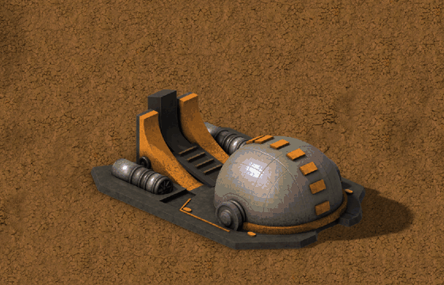
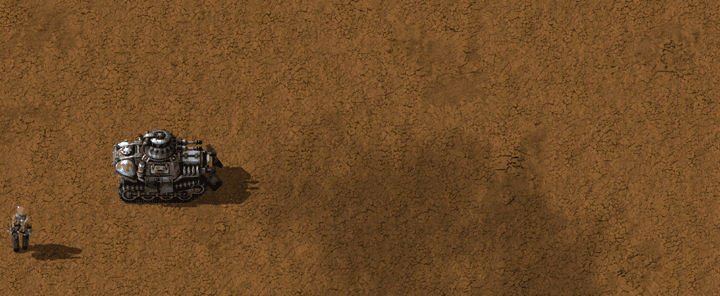

# Superweapons (Vanilla+)

**[Download it on the Factorio Mod Portal](https://mods.factorio.com/mod/superweapons)** · Factorio 2.0

Superweapons inspired by Command & Conquer: Red Alert 2, rendered in the vanilla style, with
player-colour masks and the effects and sounds of the original game.

They are **unique**: there can only be **one of each per force**. You cannot build a second one,
and the recipe is locked while you own one.

This is the **first release**: it brings the **Chronosphere**. More superweapons are on the way.

---

## Chronosphere

A huge machine that bends time and space to move your army anywhere, **even to another planet**.

- It charges **100 GJ** (up to 50 MW). Once full, its dome opens and it waits, ready to fire.
- Take the **Chronosphere control** from the shortcut bar (or press **H**). The zone that will
  travel is shown under your cursor.
- **Click the source, then the destination.** The destination can be on another planet: pick it
  from remote view. Only **explored** zones can be picked (fogged ones are fine, black ones are not).
  To cancel, click inside the source zone or put the control away (**Q**).
- The source zone is wrapped in a dome of energy, and everything inside **travels as a group**:
  characters, cars, tanks and spidertrons, **with everything they carry**, including inventory,
  equipment, quality, health and driver.
- At the destination each thing appears at the **nearest free spot**. Characters wearing **mech
  armour** land right where they should, on top of buildings if needed, and keep flying.
- Buildings, trains, robots, items on the ground, nests and worms stay where they are.

### Anything alive dies

Living beings cannot survive the trip: **biters, spitters, pentapods and other creatures in the
zone die**.

- Researching the Chronosphere also gives your engineers a **suit adaptation**: **your
  characters survive the trip on foot**. Characters of a force without it die.
- **Nobody dies inside a vehicle.**

### Recipe and research

- **Research:** *Chronosphere*, on **Aquilo**, after *Quantum processor*. It costs 5000 of each
  science pack.
- Five parts, made in the **electromagnetic plant** (no productivity, no quality): **side
  generators, cupola, dome, fission generators** and **tungsten sheets**. The five together make
  the Chronosphere.
- **Space Age is required.**

---

## Coming next

- More superweapons.
- A dedicated **heavy factory** to build their parts.

## Part of a bigger plan

Superweapons is a companion of **New Turrets (Vanilla+)** and **New Enemies (Vanilla+)**. All
three are part of a **future modpack that adds a new stage of progression** to the game, with
**a new planet**.

---

Works with Factorio 2.0 and Space Age. Feedback and bug reports are welcome in the Discussion tab.

---

☕ **Support my work**

Modding is a hobby I do in my spare time, just for the fun of it, and my mods are and will
always be free. If you enjoy them and feel like it, you can buy me a coffee:
[buymeacoffee.com/wolfenstain](https://buymeacoffee.com/wolfenstain)

No pressure at all: playing them and leaving feedback already means a lot. Thank you!

---

## Gallery

---

Questions? See the [FAQ](FAQ.md).

Licence: see [LICENSE.md](LICENSE.md).
